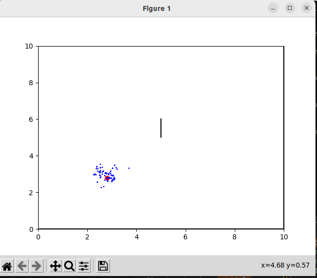

# Particle_Filter
This Repo contains the algorithm for a particle filter this is used to estimate the robot position from a 2D lidar data using a particle filter.

## Particle Filter

The particle filter is a recursive Bayesian filter that uses a set of particles (samples) to represent the posterior distribution of the state of a system. It is particularly useful for non-linear and non-Gaussian systems.

### How it Works

1. **Initialization**: Generate a set of particles with initial positions and weights.
2. **Prediction**: Move each particle according to the motion model.
3. **Update**: Update the weights of each particle based on the likelihood of the observed data.
4. **Resampling**: Resample particles based on their weights to focus on high-probability particles.
5. **Estimation**: Estimate the state of the system based on the weighted average of the particles.

### Usage

To use the particle filter, you can refer to the implementation in [particle_filter.py](particle_filter.py). The main steps are:

1. Initialize the particle filter with the number of particles and initial state.
2. Call the `predict` method to move the particles.
3. Call the `update` method to update the weights based on sensor measurements.
4. Call the `resample` method to resample the particles.
5. Use the `estimate` method to get the estimated state.

## Visualization

### Initial Particle Distribution

### Converged Particle Distribution
